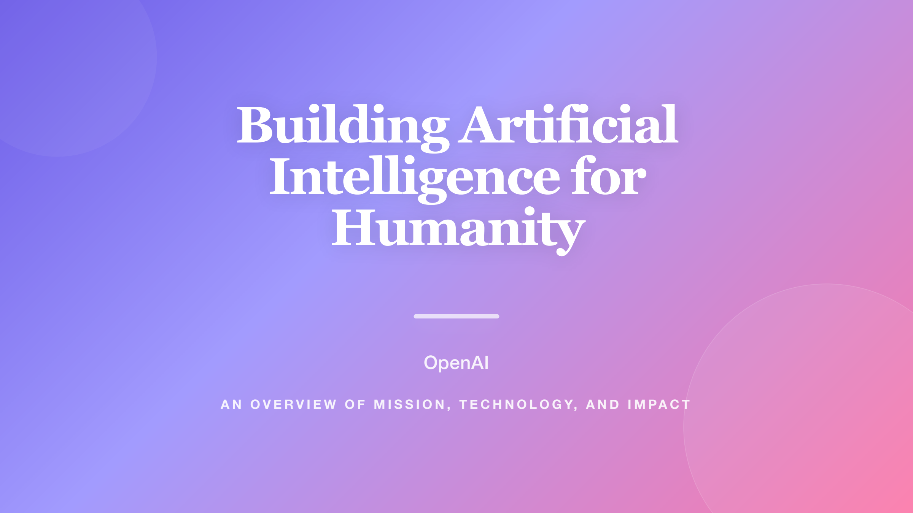
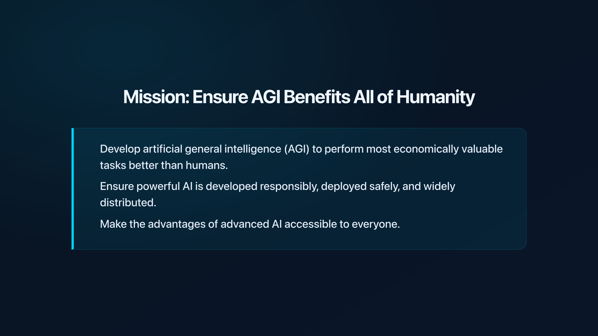
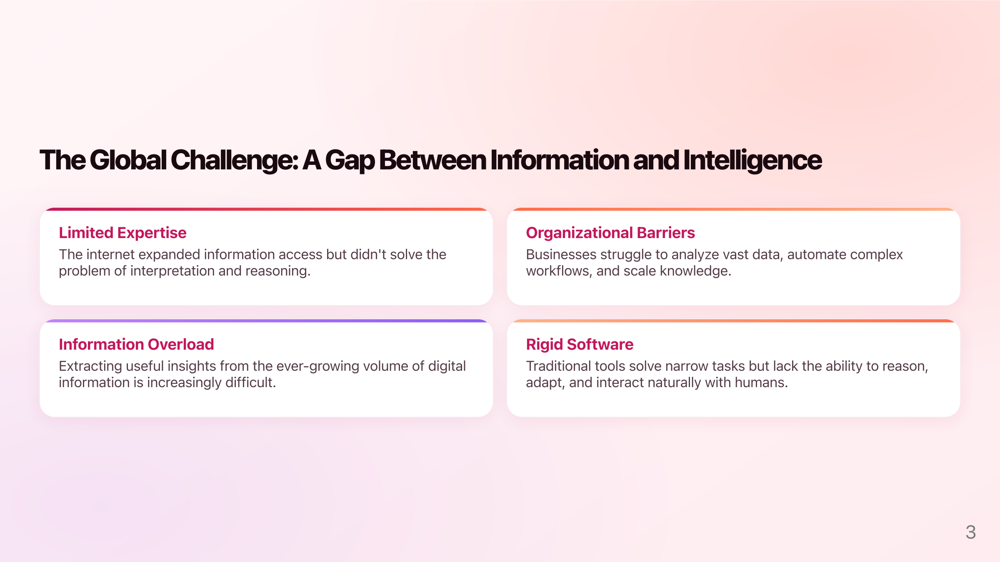
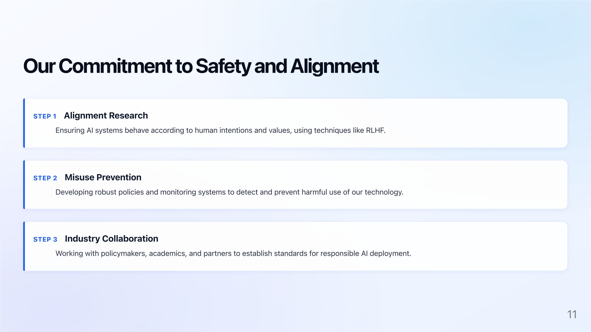
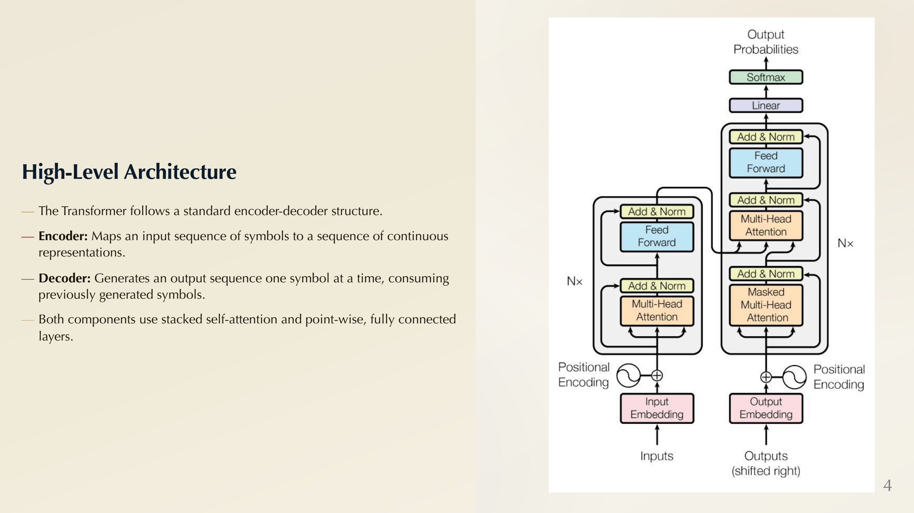
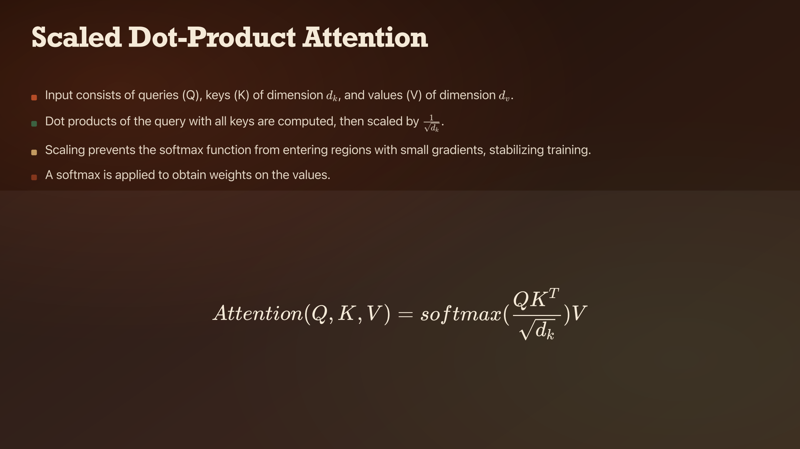
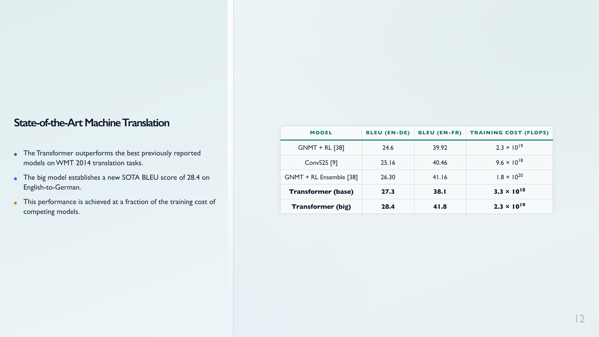
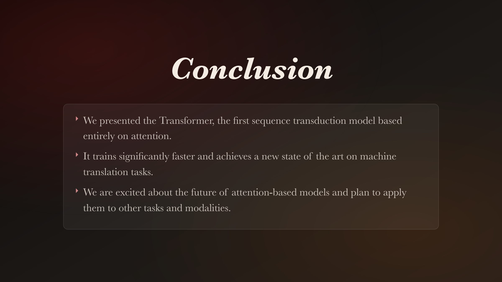

# SlidesAI 🚀

Give this tool a PDF or text file, it automatically extracts the content and builds beautiful PDF slides.

**Demos:** [OpenAI Pitch Deck](demo/openai_pitch/) · [Attention Is All You Need](demo/transformer/)

<table>
<tr>
  <td align="center"><br/><b>designer</b></td>
  <td align="center"><br/><b>editorial</b></td>
  <td align="center"><br/><b>midnight</b></td>
</tr>
<tr>
  <td align="center"><br/><b>blush</b></td>
  <td align="center"><br/><b>tech</b></td>
  <td align="center"><br/><b>premium</b></td>
</tr>
<tr>
  <td align="center"><br/><b>terra</b></td>
  <td align="center"><br/><b>slate</b></td>
  <td align="center"><br/><b>crimson</b></td>
</tr>
</table>

---

## ✨ Features
- **Smart Extraction:** Pulls text, tables, LaTeX equations, and figures from PDFs and Markdown files using `marker`.
- **LLM-Powered Writing:** Works with Gemini, OpenAI, Claude, and OpenRouter. Adjustable verbosity: concise, normal, or detailed.
- **Academic & General Purpose:** Built for research and technical content, but works for any topic or industry.
- **9 Handcrafted Themes:** Professionally designed styles with curated typography and color palettes (see below).

---

## 🛠️ Installation

**1. Clone and install everything in one command:**
```bash
git clone https://github.com/yourusername/slidesai.git
cd slidesai
python3 install.py
```

This installs all Python dependencies and Marp CLI automatically. If npm is not found, the script will skip Marp and print instructions — you only need it for PDF rendering.

*(Note: `marker-pdf` may require extra system dependencies for OCR on some platforms. Refer to their docs if you hit issues. Google Chrome or Chromium must be installed for PDF rendering.)*

**2. Setup your API Key:**
```bash
cp project_secrets.py.example project_secrets.py
```
Set `LLM_PROVIDER` and the corresponding key in `project_secrets.py`. Only the key for your chosen provider is required:

| Provider | Key variable | Default model |
|----------|-------------|---------------|
| `google` | `GEMINI_API_KEY` | `gemini-3-pro-preview` |
| `openrouter` | `OPENROUTER_API_KEY` | `gemini-3-pro-preview` |
| `openai` | `OPENAI_API_KEY` | `gpt-5.2` |
| `anthropic` | `ANTHROPIC_API_KEY` | `claude-opus-4-6` |

*(This file is gitignored to keep your keys safe.)*

---

## 🚀 Quick Start

Just point `build.py` at your file and everything happens automatically:

```bash
# From a PDF (extracts → generates slides → renders PDF)
python3 build.py paper.pdf --theme designer

# From a text or markdown file
python3 build.py notes.txt --theme midnight

# Control slide count and detail level
python3 build.py paper.pdf --theme designer --num_slides 15 --verbosity detailed

# Extract only specific pages, concise output
python3 build.py paper.pdf --theme slate --page_range 0-10 --num_slides 10 --verbosity concise

# Use a different LLM provider
python3 build.py paper.pdf --provider openai --model gpt-5.2
python3 build.py paper.pdf --provider anthropic
```

Your presentation markdown and PDF will appear in an output folder named after your input file.

> **💡 Re-style without calling the LLM again:**
> After your first build, a cached LLM response is saved. Re-run with `--use_cached` to try a different theme instantly — no API call needed:
> ```bash
> python3 build.py paper.pdf --theme midnight --use_cached
> ```

### `build.py` options
```
positional:
  input_file       Path to input file (.pdf, .txt, or .md)

options:
  -o, --output_dir   Output directory (default: folder named after input)
  --theme            Presentation theme (default: designer)
  --num_slides       Target number of slides
  --verbosity        [concise, normal, detailed]
  --provider         LLM provider: google | openrouter | openai | anthropic
  --model            Model name (e.g. gpt-5.2, claude-opus-4-6, gemini-3-pro-preview)
  --use_cached       Skip the LLM call and reuse the cached response (for re-styling)
  --page_range       Pages to extract from PDF (e.g. 0-5, 10)
  --disable_ocr      Disable OCR for PDF extraction
  --skip_pdf         Skip the final Marp-to-PDF render step
```

---

## 🎨 Themes

| Theme | Vibe |
|-------|------|
| **designer** | Modern, vibrant — purple, teal, gold |
| **editorial** | Refined, nature-inspired — forest green, gold, cream |
| **midnight** | Dark, futuristic — cyan glow, deep navy |
| **blush** | Warm, startup energy — rose, coral, peach |
| **tech** | Clean, SaaS-inspired — electric blue, slate |
| **premium** | Luxury, Apple-keynote feel — deep purple, gold |
| **terra** | Earthy, organic — terracotta, sand, forest green |
| **slate** | Minimal, corporate — cool grey, teal |
| **crimson** | Classic, academic — deep crimson, warm ivory |

---

## 🔧 Step-by-Step Pipeline (Advanced)

If you prefer finer control, you can run each step individually:

### Step 1: Extract Content from your PDF
Use the extraction script to pull text and figures out of your source document. 

```bash
python3 extract_with_marker.py --pdf_path my_paper.pdf --output_dir my_project/
```
*(This will generate a markdown file and an `images/` folder in the specified output directory).*

### Step 2: Generate the Presentation Markdown
Feed the extracted content into the AI slide builder. You can control the theme, verbosity, and length.

```bash
python3 build_slides.py \
    --input_file my_project/my_paper.md \
    --output_file my_project/my_presentation.md \
    --theme designer \
    --num_slides 15 \
    --verbosity normal
```

### Step 3: Render to PDF
Finally, turn the generated markdown into a beautiful, shareable PDF. Our rendering script ensures local images and HTML are enabled, matching VS Code's Marp export exactly.

```bash
python3 render_marp_pdf.py my_project/my_presentation.md
```
*The script will automatically find your Marp installation and Chrome browser to output `my_project/my_presentation.pdf`.*

---

## 🎛️ Advanced CLI Reference

### `extract_with_marker.py`
```
options:
  --pdf_path       Path to input PDF
  --output_dir     Directory for output assets (default: same as PDF)
  --page_range     Page range to extract (e.g. 0-5, 10, 12-14)
  --disable_ocr    Disable OCR and rely on embedded PDF text
```

### `build_slides.py`
```
options:
  --input_file     Path to your extracted content markdown
  --output_file    Path to save the generated presentation markdown
  --num_slides     Target number of slides
  --theme          [designer, editorial, midnight, blush, tech, premium, terra, slate, crimson]
  --verbosity      [concise, normal, detailed]
  --provider       LLM provider: google | openrouter | openai | anthropic
  --model          Model name (e.g. gpt-5.2, claude-sonnet-4-6, gemini-3-pro-preview)
  --use_cached     Skip the LLM call and reuse a previously saved response
```

### `render_marp_pdf.py`
```
options:
  input_md         Path to the Marp markdown file.
  -o, --output     Output PDF path (defaults to input name + .pdf)
  --browser        Browser engine Marp should use [auto, chrome, edge, firefox]
```

---

## 🤝 Contributing
Contributions are welcome! Please feel free to submit a Pull Request.

## 📄 License
[MIT License]
