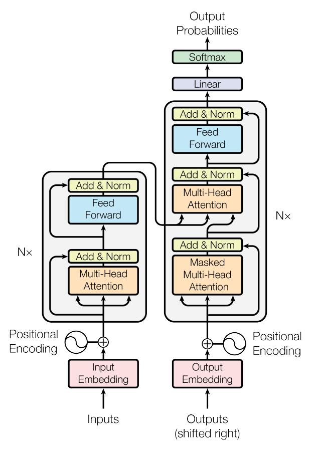
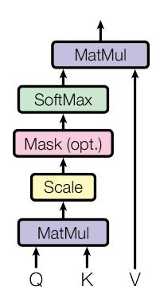
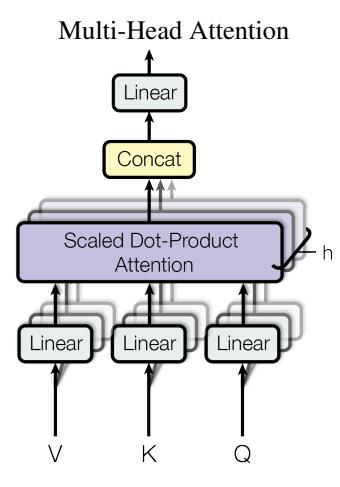
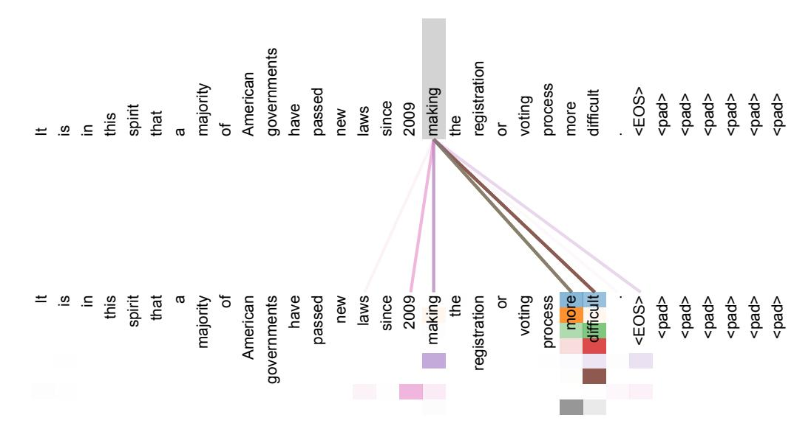

  <h1 style="color: white; margin-bottom: 20px;">Attention Is All You Need</h1>
  

  
Ashish Vaswani, Noam Shazeer, Niki Parmar, Jakob Uszkoreit, Llion Jones, Aidan N. Gomez, Łukasz Kaiser, Illia Polosukhin

  
Google Brain, Google Research, University of Toronto

---

<h1 style="font-size: 44px; margin-bottom: 20px;">The Challenge of Sequential Models</h1>

- Dominant models like RNNs and LSTMs are inherently sequential, processing data token-by-token.
- This sequential nature ($h_t$ depends on $h_{t-1}$) prevents parallelization within examples.
- Learning long-range dependencies is a key challenge due to long signal paths and vanishing gradients.
- Memory constraints limit batching across examples for long sequences.

---

<h1 style="font-size: 44px; margin-bottom: 20px;">A New Architecture: The Transformer</h1>

- We propose a network architecture based solely on attention mechanisms.
- It dispenses with recurrence and convolutions entirely.
- This design allows for significantly more parallelization, reducing training time.
- Achieves state-of-the-art translation quality while requiring less time to train.

---

<h1 style="font-size: 30px; margin-bottom: 18px;">High-Level Architecture</h1>

- The Transformer follows a standard encoder-decoder structure.
- <b>Encoder:</b> Maps an input sequence of symbols to a sequence of continuous representations.
- <b>Decoder:</b> Generates an output sequence one symbol at a time, consuming previously generated symbols.
- Both components use stacked self-attention and point-wise, fully connected layers.

---

<h1 style="font-size: 38px; margin-bottom: 20px;">The Core Mechanism: Attention</h1>

- An attention function maps a query and a set of key-value pairs to an output.
- The output is a weighted sum of the values, where weights are computed based on query-key compatibility.
- We use a specific implementation called Scaled Dot-Product Attention.

---

  <h1 style="margin-bottom: 20px; font-size: 44px; margin-bottom: 20px;">Scaled Dot-Product Attention</h1>
  

- Input consists of queries (Q), keys (K) of dimension $d_k$, and values (V) of dimension $d_v$.
- Dot products of the query with all keys are computed, then scaled by $\frac{1}{\sqrt{d_k}}$.
- Scaling prevents the softmax function from entering regions with small gradients, stabilizing training.
- A softmax is applied to obtain weights on the values.

  

$$
Attention(Q, K, V) = softmax(\frac{QK^{T}}{\sqrt{d_k}})V
$$

---

<h1 style="font-size: 30px; margin-bottom: 18px;">Multi-Head Attention</h1>

- Instead of a single attention function, we use multiple attention 'heads' in parallel.
- Queries, keys, and values are linearly projected $h$ times with different learned projections.
- This allows the model to jointly attend to information from different representation subspaces at different positions.
- Outputs from each head are concatenated and projected to form the final result.

---

  <h1 style="margin-bottom: 20px; font-size: 44px; margin-bottom: 20px;">Multi-Head Attention in Detail</h1>
  

- We use $h=8$ parallel attention heads.
- For each head, we use reduced key, value, and query dimensions: $d_k = d_v = d_{model}/h = 64$.
- The total computational cost is similar to single-head attention with full dimensionality.

  

$$
\begin{aligned} \text{MultiHead}(Q, K, V) &= \text{Concat}(\text{head}_1, \ldots, \text{head}_h) W^O \\ \text{where head}_i &= \text{Attention}(QW_i^Q, KW_i^K, VW_i^V) \end{aligned}
$$

---

<h1 style="font-size: 44px; margin-bottom: 20px;">Layer Structure</h1>

Encoder Layer

<ul>
<li>Composed of two sub-layers:</li>
</ul>

i. Multi-Head Self-Attention 
ii. Position-wise Feed-Forward Network

<ul>
<li>Residual connections and Layer Normalization are applied around each sub-layer.</li>
</ul>

Decoder Layer

<ul>
<li>Composed of three sub-layers:</li>
</ul>

i. Masked Multi-Head Self-Attention 
ii. Encoder-Decoder Attention 
iii. Position-wise Feed-Forward Network

<ul>
<li>Masking in the self-attention layer preserves the auto-regressive property.</li>
</ul>

---

  <h1 style="margin-bottom: 20px; font-size: 44px; margin-bottom: 20px;">Positional Encoding</h1>
  

- Since the model contains no recurrence or convolution, we must inject information about token position.
- We add 'positional encodings' to the input embeddings at the bottom of the encoder and decoder stacks.
- We use sine and cosine functions of different frequencies.

  

$$
\begin{aligned} PE_{(pos,2i)} &= \sin(pos/10000^{2i/d_{\rm model}}) \\ PE_{(pos,2i+1)} &= \cos(pos/10000^{2i/d_{\rm model}}) \end{aligned}
$$

---

<h1 style="font-size: 26px; margin-bottom: 16px;">Why Self-Attention?</h1>

- Self-attention layers offer advantages in computational complexity, parallelization, and learning long-range dependencies.
- The path length between any two positions is constant ($O(1)$), unlike in recurrent ($O(n)$) or convolutional ($O(\log_k(n))$) layers.

<table class="table-clean" style="width: auto; max-width: 100%; border-collapse: collapse; font-size: 14px; margin: 10px auto 0 auto; box-sizing: border-box;">
  <thead>
    <tr style="background-color: var(--bg-header); border-bottom: 2px solid var(--accent);">
      <th style="padding: 6px 8px; text-align: center; font-weight: bold; color: var(--accent); border: 1px solid var(--border-color); word-break: break-word; overflow-wrap: anywhere;">Layer Type</th>
      <th style="padding: 6px 8px; text-align: center; font-weight: bold; color: var(--accent); border: 1px solid var(--border-color); word-break: break-word; overflow-wrap: anywhere;">Complexity per Layer</th>
      <th style="padding: 6px 8px; text-align: center; font-weight: bold; color: var(--accent); border: 1px solid var(--border-color); word-break: break-word; overflow-wrap: anywhere;">Sequential Operations</th>
      <th style="padding: 6px 8px; text-align: center; font-weight: bold; color: var(--accent); border: 1px solid var(--border-color); word-break: break-word; overflow-wrap: anywhere;">Maximum Path Length</th>
    </tr>
  </thead>
    <tr style="background-color: var(--bg-row-even);">
      <td style="padding: 5px 8px; text-align: center; border: 1px solid var(--border-color); word-break: break-word; overflow-wrap: anywhere;">
Self-Attention
</td>
      <td style="padding: 5px 8px; text-align: center; border: 1px solid var(--border-color); word-break: break-word; overflow-wrap: anywhere;">
O(n2 &middot; d)
</td>
      <td style="padding: 5px 8px; text-align: center; border: 1px solid var(--border-color); word-break: break-word; overflow-wrap: anywhere;">
O(1)
</td>
      <td style="padding: 5px 8px; text-align: center; border: 1px solid var(--border-color); word-break: break-word; overflow-wrap: anywhere;">
O(1)
</td>
    </tr>
    <tr >
      <td style="padding: 5px 8px; text-align: center; border: 1px solid var(--border-color); word-break: break-word; overflow-wrap: anywhere;">
Recurrent
</td>
      <td style="padding: 5px 8px; text-align: center; border: 1px solid var(--border-color); word-break: break-word; overflow-wrap: anywhere;">
O(n &middot; d2)
</td>
      <td style="padding: 5px 8px; text-align: center; border: 1px solid var(--border-color); word-break: break-word; overflow-wrap: anywhere;">
O(n)
</td>
      <td style="padding: 5px 8px; text-align: center; border: 1px solid var(--border-color); word-break: break-word; overflow-wrap: anywhere;">
O(n)
</td>
    </tr>
    <tr style="background-color: var(--bg-row-even);">
      <td style="padding: 5px 8px; text-align: center; border: 1px solid var(--border-color); word-break: break-word; overflow-wrap: anywhere;">
Convolutional
</td>
      <td style="padding: 5px 8px; text-align: center; border: 1px solid var(--border-color); word-break: break-word; overflow-wrap: anywhere;">
O(k &middot; n &middot; d2)
</td>
      <td style="padding: 5px 8px; text-align: center; border: 1px solid var(--border-color); word-break: break-word; overflow-wrap: anywhere;">
O(1)
</td>
      <td style="padding: 5px 8px; text-align: center; border: 1px solid var(--border-color); word-break: break-word; overflow-wrap: anywhere;">
O(logk(n))
</td>
    </tr>
    <tr >
      <td style="padding: 5px 8px; text-align: center; border: 1px solid var(--border-color); word-break: break-word; overflow-wrap: anywhere;">
Self-Attention (restricted)
</td>
      <td style="padding: 5px 8px; text-align: center; border: 1px solid var(--border-color); word-break: break-word; overflow-wrap: anywhere;">
O(r &middot; n &middot; d)
</td>
      <td style="padding: 5px 8px; text-align: center; border: 1px solid var(--border-color); word-break: break-word; overflow-wrap: anywhere;">
O(1)
</td>
      <td style="padding: 5px 8px; text-align: center; border: 1px solid var(--border-color); word-break: break-word; overflow-wrap: anywhere;">
O(n/r)
</td>
    </tr>
  </tbody>
</table>

---

<h1 style="font-size: 24px; margin-bottom: 16px;">State-of-the-Art Machine Translation</h1>

- The Transformer outperforms the best previously reported models on WMT 2014 translation tasks.
- The big model establishes a new SOTA BLEU score of 28.4 on English-to-German.
- This performance is achieved at a fraction of the training cost of competing models.

<table class="table-clean" style="width: auto; max-width: 100%; border-collapse: collapse; font-size: 14px; margin: 10px auto 0 auto; box-sizing: border-box;">
  <thead>
    <tr style="background-color: var(--bg-header); border-bottom: 2px solid var(--accent);">
      <th style="padding: 6px 8px; text-align: center; font-weight: bold; color: var(--accent); border: 1px solid var(--border-color); word-break: break-word; overflow-wrap: anywhere;">Model</th>
      <th style="padding: 6px 8px; text-align: center; font-weight: bold; color: var(--accent); border: 1px solid var(--border-color); word-break: break-word; overflow-wrap: anywhere;">BLEU (EN-DE)</th>
      <th style="padding: 6px 8px; text-align: center; font-weight: bold; color: var(--accent); border: 1px solid var(--border-color); word-break: break-word; overflow-wrap: anywhere;">BLEU (EN-FR)</th>
      <th style="padding: 6px 8px; text-align: center; font-weight: bold; color: var(--accent); border: 1px solid var(--border-color); word-break: break-word; overflow-wrap: anywhere;">Training Cost (FLOPs)</th>
    </tr>
  </thead>
    <tr style="background-color: var(--bg-row-even);">
      <td style="padding: 5px 8px; text-align: center; border: 1px solid var(--border-color); word-break: break-word; overflow-wrap: anywhere;">
GNMT + RL [38]
</td>
      <td style="padding: 5px 8px; text-align: center; border: 1px solid var(--border-color); word-break: break-word; overflow-wrap: anywhere;">
24.6
</td>
      <td style="padding: 5px 8px; text-align: center; border: 1px solid var(--border-color); word-break: break-word; overflow-wrap: anywhere;">
39.92
</td>
      <td style="padding: 5px 8px; text-align: center; border: 1px solid var(--border-color); word-break: break-word; overflow-wrap: anywhere;">
2.3 &times; 1019
</td>
    </tr>
    <tr >
      <td style="padding: 5px 8px; text-align: center; border: 1px solid var(--border-color); word-break: break-word; overflow-wrap: anywhere;">
ConvS2S [9]
</td>
      <td style="padding: 5px 8px; text-align: center; border: 1px solid var(--border-color); word-break: break-word; overflow-wrap: anywhere;">
25.16
</td>
      <td style="padding: 5px 8px; text-align: center; border: 1px solid var(--border-color); word-break: break-word; overflow-wrap: anywhere;">
40.46
</td>
      <td style="padding: 5px 8px; text-align: center; border: 1px solid var(--border-color); word-break: break-word; overflow-wrap: anywhere;">
9.6 &times; 1018
</td>
    </tr>
    <tr style="background-color: var(--bg-row-even);">
      <td style="padding: 5px 8px; text-align: center; border: 1px solid var(--border-color); word-break: break-word; overflow-wrap: anywhere;">
GNMT + RL Ensemble [38]
</td>
      <td style="padding: 5px 8px; text-align: center; border: 1px solid var(--border-color); word-break: break-word; overflow-wrap: anywhere;">
26.30
</td>
      <td style="padding: 5px 8px; text-align: center; border: 1px solid var(--border-color); word-break: break-word; overflow-wrap: anywhere;">
41.16
</td>
      <td style="padding: 5px 8px; text-align: center; border: 1px solid var(--border-color); word-break: break-word; overflow-wrap: anywhere;">
1.8 &times; 1020
</td>
    </tr>
    <tr >
      <td style="padding: 5px 8px; text-align: center; border: 1px solid var(--border-color); word-break: break-word; overflow-wrap: anywhere;">
<strong>Transformer (base)</strong>
</td>
      <td style="padding: 5px 8px; text-align: center; border: 1px solid var(--border-color); word-break: break-word; overflow-wrap: anywhere;">
<strong>27.3</strong>
</td>
      <td style="padding: 5px 8px; text-align: center; border: 1px solid var(--border-color); word-break: break-word; overflow-wrap: anywhere;">
<strong>38.1</strong>
</td>
      <td style="padding: 5px 8px; text-align: center; border: 1px solid var(--border-color); word-break: break-word; overflow-wrap: anywhere;">
<strong>3.3 &times; 1018</strong>
</td>
    </tr>
    <tr style="background-color: var(--bg-row-even);">
      <td style="padding: 5px 8px; text-align: center; border: 1px solid var(--border-color); word-break: break-word; overflow-wrap: anywhere;">
<strong>Transformer (big)</strong>
</td>
      <td style="padding: 5px 8px; text-align: center; border: 1px solid var(--border-color); word-break: break-word; overflow-wrap: anywhere;">
<strong>28.4</strong>
</td>
      <td style="padding: 5px 8px; text-align: center; border: 1px solid var(--border-color); word-break: break-word; overflow-wrap: anywhere;">
<strong>41.8</strong>
</td>
      <td style="padding: 5px 8px; text-align: center; border: 1px solid var(--border-color); word-break: break-word; overflow-wrap: anywhere;">
<strong>2.3 &times; 1019</strong>
</td>
    </tr>
  </tbody>
</table>

---

<h1 style="font-size: 34px; margin-bottom: 18px;">Ablation Studies</h1>

- We varied components to measure their importance on English-to-German translation.
- (A) 8 attention heads were found to be optimal.
- (D) Dropout is very helpful in avoiding over-fitting.
- (E) Sinusoidal positional encodings perform nearly identically to learned embeddings.

<table class="table-clean" style="width: auto; max-width: 100%; border-collapse: collapse; font-size: 16px; margin: 10px auto 0 auto; box-sizing: border-box;">
  <thead>
    <tr style="background-color: var(--bg-header); border-bottom: 2px solid var(--accent);">
      <th style="padding: 6px 8px; text-align: center; font-weight: bold; color: var(--accent); border: 1px solid var(--border-color); word-break: break-word; overflow-wrap: anywhere;">Variation</th>
      <th style="padding: 6px 8px; text-align: center; font-weight: bold; color: var(--accent); border: 1px solid var(--border-color); word-break: break-word; overflow-wrap: anywhere;">PPL (dev)</th>
      <th style="padding: 6px 8px; text-align: center; font-weight: bold; color: var(--accent); border: 1px solid var(--border-color); word-break: break-word; overflow-wrap: anywhere;">BLEU (dev)</th>
    </tr>
  </thead>
    <tr style="background-color: var(--bg-row-even);">
      <td style="padding: 5px 8px; text-align: center; border: 1px solid var(--border-color); word-break: break-word; overflow-wrap: anywhere;">
<strong>base (h=8)</strong>
</td>
      <td style="padding: 5px 8px; text-align: center; border: 1px solid var(--border-color); word-break: break-word; overflow-wrap: anywhere;">
<strong>4.92</strong>
</td>
      <td style="padding: 5px 8px; text-align: center; border: 1px solid var(--border-color); word-break: break-word; overflow-wrap: anywhere;">
<strong>25.8</strong>
</td>
    </tr>
    <tr >
      <td style="padding: 5px 8px; text-align: center; border: 1px solid var(--border-color); word-break: break-word; overflow-wrap: anywhere;">
(A) h=1
</td>
      <td style="padding: 5px 8px; text-align: center; border: 1px solid var(--border-color); word-break: break-word; overflow-wrap: anywhere;">
5.29
</td>
      <td style="padding: 5px 8px; text-align: center; border: 1px solid var(--border-color); word-break: break-word; overflow-wrap: anywhere;">
24.9
</td>
    </tr>
    <tr style="background-color: var(--bg-row-even);">
      <td style="padding: 5px 8px; text-align: center; border: 1px solid var(--border-color); word-break: break-word; overflow-wrap: anywhere;">
(A) h=16
</td>
      <td style="padding: 5px 8px; text-align: center; border: 1px solid var(--border-color); word-break: break-word; overflow-wrap: anywhere;">
4.91
</td>
      <td style="padding: 5px 8px; text-align: center; border: 1px solid var(--border-color); word-break: break-word; overflow-wrap: anywhere;">
25.8
</td>
    </tr>
    <tr >
      <td style="padding: 5px 8px; text-align: center; border: 1px solid var(--border-color); word-break: break-word; overflow-wrap: anywhere;">
(D) Pdrop=0.0
</td>
      <td style="padding: 5px 8px; text-align: center; border: 1px solid var(--border-color); word-break: break-word; overflow-wrap: anywhere;">
5.77
</td>
      <td style="padding: 5px 8px; text-align: center; border: 1px solid var(--border-color); word-break: break-word; overflow-wrap: anywhere;">
24.6
</td>
    </tr>
    <tr style="background-color: var(--bg-row-even);">
      <td style="padding: 5px 8px; text-align: center; border: 1px solid var(--border-color); word-break: break-word; overflow-wrap: anywhere;">
(E) Learned Positional Embedding
</td>
      <td style="padding: 5px 8px; text-align: center; border: 1px solid var(--border-color); word-break: break-word; overflow-wrap: anywhere;">
4.92
</td>
      <td style="padding: 5px 8px; text-align: center; border: 1px solid var(--border-color); word-break: break-word; overflow-wrap: anywhere;">
25.7
</td>
    </tr>
    <tr >
      <td style="padding: 5px 8px; text-align: center; border: 1px solid var(--border-color); word-break: break-word; overflow-wrap: anywhere;">
<strong>big</strong>
</td>
      <td style="padding: 5px 8px; text-align: center; border: 1px solid var(--border-color); word-break: break-word; overflow-wrap: anywhere;">
<strong>4.33</strong>
</td>
      <td style="padding: 5px 8px; text-align: center; border: 1px solid var(--border-color); word-break: break-word; overflow-wrap: anywhere;">
<strong>26.4</strong>
</td>
    </tr>
  </tbody>
</table>

---

<h1 style="font-size: 32px; margin-bottom: 18px;">Generalizing to Other Tasks: Parsing</h1>

- To test generalization, we applied the Transformer to English constituency parsing.
- The model performs surprisingly well with minimal task-specific tuning.
- It outperforms the BerkeleyParser even when trained only on the small 40K sentence WSJ dataset.

<table class="table-clean" style="width: auto; max-width: 100%; border-collapse: collapse; font-size: 16px; margin: 10px auto 0 auto; box-sizing: border-box;">
  <thead>
    <tr style="background-color: var(--bg-header); border-bottom: 2px solid var(--accent);">
      <th style="padding: 6px 8px; text-align: center; font-weight: bold; color: var(--accent); border: 1px solid var(--border-color); word-break: break-word; overflow-wrap: anywhere;">Parser</th>
      <th style="padding: 6px 8px; text-align: center; font-weight: bold; color: var(--accent); border: 1px solid var(--border-color); word-break: break-word; overflow-wrap: anywhere;">Training Setting</th>
      <th style="padding: 6px 8px; text-align: center; font-weight: bold; color: var(--accent); border: 1px solid var(--border-color); word-break: break-word; overflow-wrap: anywhere;">WSJ 23 F1 Score</th>
    </tr>
  </thead>
    <tr style="background-color: var(--bg-row-even);">
      <td style="padding: 5px 8px; text-align: center; border: 1px solid var(--border-color); word-break: break-word; overflow-wrap: anywhere;">
Recurrent Neural Network Grammar
</td>
      <td style="padding: 5px 8px; text-align: center; border: 1px solid var(--border-color); word-break: break-word; overflow-wrap: anywhere;">
generative
</td>
      <td style="padding: 5px 8px; text-align: center; border: 1px solid var(--border-color); word-break: break-word; overflow-wrap: anywhere;">
93.3
</td>
    </tr>
    <tr >
      <td style="padding: 5px 8px; text-align: center; border: 1px solid var(--border-color); word-break: break-word; overflow-wrap: anywhere;">
Vinyals &amp; Kaiser et al. (2015)
</td>
      <td style="padding: 5px 8px; text-align: center; border: 1px solid var(--border-color); word-break: break-word; overflow-wrap: anywhere;">
semi-supervised
</td>
      <td style="padding: 5px 8px; text-align: center; border: 1px solid var(--border-color); word-break: break-word; overflow-wrap: anywhere;">
92.1
</td>
    </tr>
    <tr style="background-color: var(--bg-row-even);">
      <td style="padding: 5px 8px; text-align: center; border: 1px solid var(--border-color); word-break: break-word; overflow-wrap: anywhere;">
<strong>Transformer (4 layers)</strong>
</td>
      <td style="padding: 5px 8px; text-align: center; border: 1px solid var(--border-color); word-break: break-word; overflow-wrap: anywhere;">
<strong>semi-supervised</strong>
</td>
      <td style="padding: 5px 8px; text-align: center; border: 1px solid var(--border-color); word-break: break-word; overflow-wrap: anywhere;">
<strong>92.7</strong>
</td>
    </tr>
    <tr >
      <td style="padding: 5px 8px; text-align: center; border: 1px solid var(--border-color); word-break: break-word; overflow-wrap: anywhere;">
Dyer et al. (2016)
</td>
      <td style="padding: 5px 8px; text-align: center; border: 1px solid var(--border-color); word-break: break-word; overflow-wrap: anywhere;">
WSJ only
</td>
      <td style="padding: 5px 8px; text-align: center; border: 1px solid var(--border-color); word-break: break-word; overflow-wrap: anywhere;">
91.7
</td>
    </tr>
    <tr style="background-color: var(--bg-row-even);">
      <td style="padding: 5px 8px; text-align: center; border: 1px solid var(--border-color); word-break: break-word; overflow-wrap: anywhere;">
<strong>Transformer (4 layers)</strong>
</td>
      <td style="padding: 5px 8px; text-align: center; border: 1px solid var(--border-color); word-break: break-word; overflow-wrap: anywhere;">
<strong>WSJ only</strong>
</td>
      <td style="padding: 5px 8px; text-align: center; border: 1px solid var(--border-color); word-break: break-word; overflow-wrap: anywhere;">
<strong>91.3</strong>
</td>
    </tr>
  </tbody>
</table>

---

<h1 style="font-size: 26px; margin-bottom: 16px;">Visualizing Attention</h1>

- Self-attention mechanisms can lead to more interpretable models.
- We can inspect attention distributions to see how the model represents syntactic and semantic structures.
- Different attention heads learn to perform different tasks, such as tracking long-distance dependencies or resolving anaphora.

---

<h1>Conclusion</h1>

<ul>
<li>We presented the Transformer, the first sequence transduction model based entirely on attention.</li>
<li>It trains significantly faster and achieves a new state of the art on machine translation tasks.</li>
<li>We are excited about the future of attention-based models and plan to apply them to other tasks and modalities.</li>
</ul>

